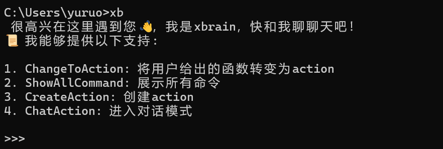

## 介绍

xbrain 是一款函数即智能架构。

我们是Function-as-a-Agent 简写为 Faaa。xbrain 提供一个微型的架构，用户不需要编写复杂提示词、交互逻辑或AI服务。

## 特点

1. 普通python函数秒变智能；
2. 0学习成本，在终端与xbrain聊天完成函数转换、开发；
3. 0代码部署为AI server。

## 使用指南

使用 `pip install -U pyxbrain`安装最新版本，安装完成后，在命令行输入 `xb` 即可开启对话。



## 常见问题

1. 如果输入 `xb` 时提示：“'xb' 不是内部或外部命令，也不是可运行的程序或批处理文件”。你需要把python的Scripts目录设置在环境变量下。

## 开发指南

打包成 whl 文件：

```
py -m pip install --upgrade build
py -m build
```

在 `C:\Users\用户名`下的 `.pypirc`文件配置基本信息：

```
[distutils]
index-servers = pypi
[pypi]
#测试环境
repository = https://upload.pypi.org/legacy/
username = __token__
password = token
```

上传到官方：

`py -m twine upload dist/*`
