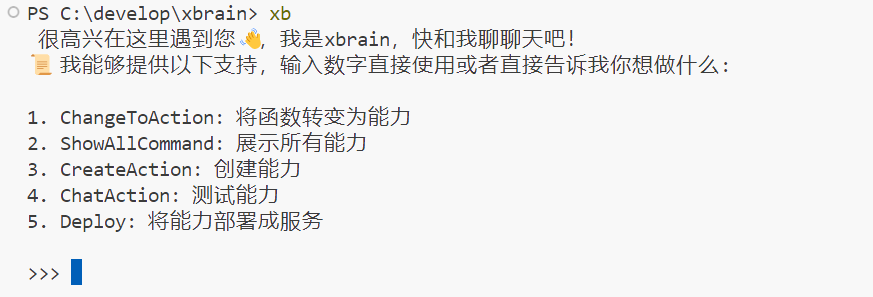

<h1>XBrain</h1>

一个开源的函数即智能架构。

 [Issues need help][help-wanted-url]

🎞️[介绍视频](https://www.bilibili.com/video/BV1c52FY4E51/?share_source=copy_web&vd_source=c28e503b050f016c21660b69e391d391)

## 适合谁？

### 您是否面临如下问题？

- Agent开发繁琐，想快速交付的项目。

* 要加速迭代Agent产品，提高产品竞争力。
* 小B公司接项目，苦于Agent短板。
* 想懂代码，想从事AI相关工作，不想从0开始学。
* …

### 您是否了解过这些产品？

- coze
- dify
- langchain
- ...

### 您是否遇到以下困惑？

* workflow可视化可以，没法用来做业务应用。
* Agent一堆技术栈，学哪一个都要补知识。
* 低代码平台太复杂，影响开发效率，一堆概念和配置，还受限。
* …

---

**那么，恭喜，XBrain将使您眼前一亮，如获至宝！**

这是一款函数即智能架构，支持将普通函数秒变智能、开箱即用、用户无需任何Agent开发技能，即可快速搭建Agent应用，不止于聊天。

## 使用指南

使用 `pip install -U pyxbrain`安装最新版本，安装完成后，在命令行输入 `xb` 即可开启对话。

## 常见问题

1. 如果输入 `xb` 时提示：“'xb' 不是内部或外部命令，也不是可运行的程序或批处理文件”。你需要把python的Scripts目录设置在环境变量下。
