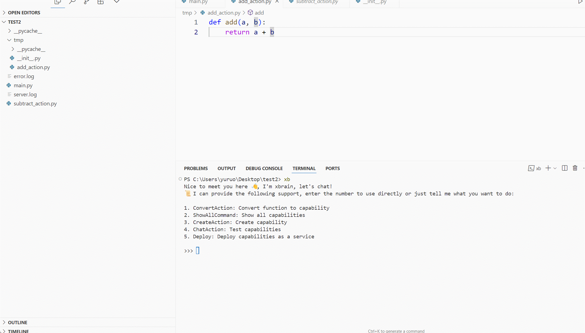
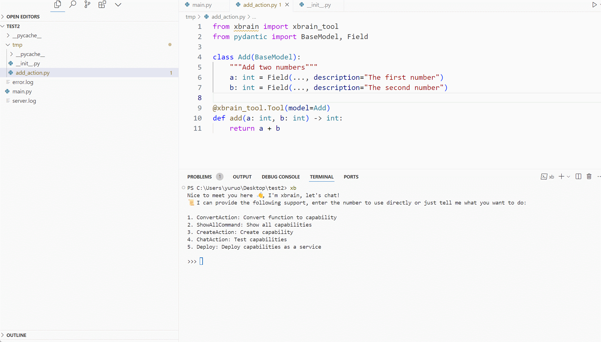

<a name="readme-top">

<h1>XBrain</h1>

一个开源的函数即智能架构。

🎞️[介绍视频](https://www.bilibili.com/video/BV1c52FY4E51/?share_source=copy_web&vd_source=c28e503b050f016c21660b69e391d391)|🗨[English](https://github.com/yuruotong1/xbrain/blob/master/README_EN.md)

我们想让任何一名开发者都能快速驾驭大模型。

我们专注于构建 agent less，像 serverless 一样，开发者无需关心底层 Agent，直接将一个普通函数秒变智能。

## ✨特点

* 🌈让普通函数轻松变智能：快速为您的函数赋予AI能力，提升应用性能。
* 🔍 通过聊天界面智能生成代码：以对话方式与系统交互，加速开发过程。
* 📦一键部署聊天服务器：快速上线，让用户及时体验您的智能功能。

## 🖥竞对是谁？

- LangChain
- coze
- dify

## ⌨️谁会需要？

**客户是哪些？**

1. 拥有传统互联网业务的小B公司，他们没有专业的Agent开发人员，希望通过AI扩展新业务；
2. 掌握python基础语法的开发人员，他们不懂agent，但希望借用大模型加速业务开发。

**客户故事**

1. 公司A在coze/langchain跑了初版Demo，准备商业化发现用户体验差不愿意付费。但可惜公司缺少Agent的人才，A只能让程序员加班加点修改插件代码去兼容每一种异常，当业务越来越多时，这种现象越来越普遍，于是他们利用xbrain进行重构，发现AI执行过程可控，开发者不需要频繁修改插件就能给用户带来非常好的体验。
2. 公司B想借助AI加速完成业务需求，但是没有熟悉AI的人员，langchain的学习成本高，于是采用xbrain框架与AI对话快速接入。

---

## 🍬使用指南

使用 `pip install -U pyxbrain`安装最新版本，安装完成后，在命令行输入 `xb` 即可开启对话。

### 让普通函数轻松变智能

通过在终端与xbrain进行对话，选择 `ConvertAction`，将任意一个普通的python函数转变为xbrain可识别的action。

### 通过聊天界面智能生成代码

通过在终端与xbrain进行对话，选择 `CreateAction`，输入你的需求，从0到1智能生成action，自动接入xbrain。

### 一键部署聊天服务器

通过在终端与xbrain进行对话，选择 `deploy`，一键部署为chat server，可通过api与之对话。

## 🤝常见问题

1. 如果输入 `xb` 时提示：“'xb' 不是内部或外部命令，也不是可运行的程序或批处理文件”。你需要把python的Scripts目录设置在环境变量下。
